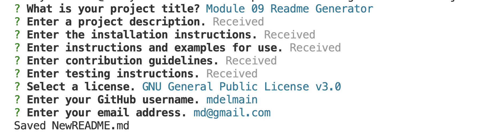

# 09 README Generator

## Description 
For the module 9 assignment I built a README generator in JavaScript. The application uses Node along with the Inquirer package to create the README file by collecting user input via the command line. 

A demo of the tool can be found here: https://drive.google.com/file/d/1L663WjteaYhqKJJHuQOBGc2OPYJFqmgN/view

## Installation
To install node on mac, use `brew install nvm` and `nvm install 16`.
Use `npm install` to install the inquirer package / required packages.

## Usage
The user will need to type `node index.js` on the command line to launch a series of questions. Once the questions are answered, the information is written to "NewREADME.md"

## User Story

```
AS A developer
I WANT a README generator
SO THAT I can quickly create a professional README for a new project
```

## Acceptance Criteria 

```
GIVEN a command-line application that accepts user input
WHEN I am prompted for information about my application repository
THEN a high-quality, professional README.md is generated with the title of my project and sections entitled Description, Table of Contents, Installation, Usage, License, Contributing, Tests, and Questions
WHEN I enter my project title
THEN this is displayed as the title of the README
WHEN I enter a description, installation instructions, usage information, contribution guidelines, and test instructions
THEN this information is added to the sections of the README entitled Description, Installation, Usage, Contributing, and Tests
WHEN I choose a license for my application from a list of options
THEN a badge for that license is added near the top of the README and a notice is added to the section of the README entitled License that explains which license the application is covered under
WHEN I enter my GitHub username
THEN this is added to the section of the README entitled Questions, with a link to my GitHub profile
WHEN I enter my email address
THEN this is added to the section of the README entitled Questions, with instructions on how to reach me with additional questions
WHEN I click on the links in the Table of Contents
THEN I am taken to the corresponding section of the README
```

## Mock-Up

The following image shows the web application's appearance and functionality:

